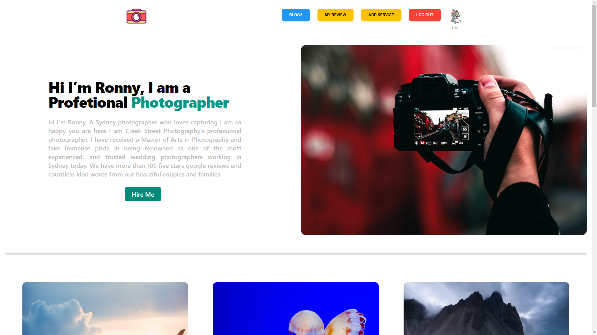

# Pro Photo

# Links

- [Live Website]( https://my-review-32ae3.web.app/)
- [Server Link](https://review-server-iota.vercel.app/)
- [Github Repo](https://github.com/Porgramming-Hero-web-course/b6a11-service-review-client-side-MdRafiurRahmanSaikat)

## Authors

- [@MdRafiurRahmanSaikat](https://github.com/MdRafiurRahmanSaikat/)

## Tech Stack

**Client:** React, Redux, TailwindCSS ,MUI, Float UI

**Passiion:** I Do it for my plasure.

**Subcribe:** You can contact me and Please Subcribe the NewsStller to get Notified About My Post.

**About:** Hi I’m Ronny, I am a Profetional Photographer  A Sydney photographer who loves capturing I am so happy you are here I am Creek Street Photography’s professional photographer. I have received a Master of Arts in Photography and take immense pride in being renowned as one of the most experienced. and trusted wedding photographers working in Sydney today. We have more than 100 five stars google reviews and countless kind words from our beautiful couples and families. ,

**Server:** Node, Express,Dot Env ,

## Tools Used

- [Tailwindcss](https://tailwindcss.com/)
- [React Router](https://reactrouter.com/en/main)

- [Express](https://expressjs.com/)
- [Firebase](https://firebase.google.com/)
- [MUI](https://expressjs.com/)
- [JWT](https://firebase.google.com/)

## Screenshots

## Features

- Light/dark mode toggle
- Fully responsive
- Live previews
- Fullscreen mode
- Cross platform
- Firebase Auth

## License

[MIT](https://choosealicense.com/licenses/mit/)
